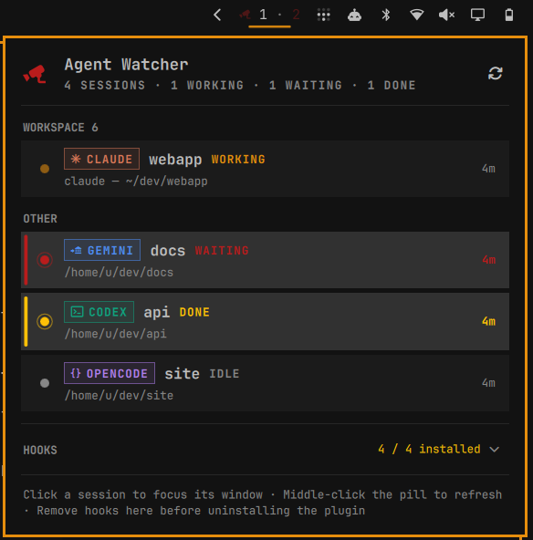

# Agent Watcher for Omarchy

One bar pill for every AI-agent session on your desktop. Claude Code, Codex,
Gemini CLI and OpenCode sessions are listed per Hyprland workspace with their
state — **working**, **waiting** for you, **done** — and the pill blinks
(green = finished, yellow = needs a permission) whenever that happens in a
window you are not looking at. Focus the window and the blink stops; click a
row in the panel to jump straight to it. A session with no activity to report
(idle) is never listed.



## Install

```sh
omarchy plugin add https://github.com/5d0tal1gat0r/omarchy-agent-watcher.git --enable
```

Then open the panel (click the camera), expand **Hooks** and flip the switch next to each agent
you use. That adds a few hook entries to the agent's own config:

| agent | what gets written | note |
|-------|-------------------|------|
| Claude Code | `~/.claude/settings.json` → `hooks` (SessionStart, UserPromptSubmit, PermissionRequest, Notification, PostToolUse, Stop, SessionEnd) | |
| Codex | `~/.codex/hooks.json` | run `/hooks` inside Codex once to trust them |
| Gemini CLI | `~/.gemini/settings.json` → `hooks` | |
| OpenCode | v1: `~/.config/opencode/plugins/agent-watcher.js` · v2: `~/.config/opencode/plugins/agent-watcher/` (TUI plugin) | |

Claude Code picks the hooks up live in most cases; if a session doesn't show
up, restart it. Codex, Gemini CLI and OpenCode load hooks at startup, and on
OpenCode v2 every already-open TUI must be restarted once after installing.
Headless `codex exec` runs need `--dangerously-bypass-hook-trust` to fire
hooks that haven't been trusted yet.

A backup `<file>.agent-watcher.bak` is written before every change, only
entries pointing at `agent-watcher-hook` are ever added or removed, and
flipping the switch off undoes it. The same works from a shell:

```sh
~/.config/omarchy/plugins/io.github.5d0tal1gat0r.agent-watcher/bin/agent-watcher-setup status all
~/.config/omarchy/plugins/io.github.5d0tal1gat0r.agent-watcher/bin/agent-watcher-setup install claude
~/.config/omarchy/plugins/io.github.5d0tal1gat0r.agent-watcher/bin/agent-watcher-setup remove claude
```

**Before removing the plugin**, switch the hooks off for each agent (or run
`agent-watcher-setup remove <agent>`); the hooks are absolute paths into the
plugin directory and would otherwise fail on every agent turn.

## Usage

| where | action | effect |
|-------|--------|--------|
| pill | left click | open / close the panel (Esc closes, Tab switches panels, Enter refreshes) |
| pill | middle click | refresh now |
| panel | click a session | focus its window (switches workspace); with no window, open it in a floating terminal — OpenCode resumes that exact session, other agents get a shell in its directory |
| panel | right click a **done** session | dismiss it from the list (a finished scheduled run, say); if it works again a fresh row appears |
| panel | **Clear all done** | dismiss every done session at once (shown under the list while any done row exists) |
| panel | **Hooks** header | expand / collapse the per-agent switches (opens by itself while nothing is installed) |
| panel | agent switch | install / remove that agent's hooks |

Pill: `󰞮 2 · 1` = 2 sessions working, 1 needs attention. Dimmed icon = no
sessions. Blink colors come from your theme (`green` / `yellow`).

Each row is named after the session: OpenCode's session title (it renames
itself after the first exchange), Claude Code's task summary (read from the
terminal title it sets), otherwise the project folder; the working directory
sits underneath. Every agent has its own mark and color so rows are easy to
tell apart at a glance.

IPC (for keybindings): `omarchy-shell io.github.5d0tal1gat0r.agent-watcher toggle|open|close|refresh`

## Configure

```sh
omarchy bar set io.github.5d0tal1gat0r.agent-watcher blinkOnDone false --json
omarchy bar set io.github.5d0tal1gat0r.agent-watcher blinkOnWaiting false --json
```

| key | default | meaning |
|-----|---------|---------|
| `blinkOnDone` | `true` | blink (green) when an agent finishes responding in an unfocused window |
| `blinkOnWaiting` | `true` | blink (yellow) when an agent is blocked on a permission prompt |

## How it works

Each agent's native hook calls `bin/agent-watcher-hook`, which writes a tiny
JSON file per session under `$XDG_RUNTIME_DIR/omarchy-agent-watcher/` and pings
the shell. The hook finds its own terminal window by walking up the process
tree, so the panel knows the workspace and can focus it; the shell reads live
window titles and focus from Hyprland. Sessions vanish on `SessionEnd`, when
their process is gone, or when their terminal window is closed (re-checked
whenever a window appears or disappears, and every 15 s). Nothing leaves your machine.

Hyprland ≥ 0.56 dispatches through a Lua API, so the plugin sends both the Lua
(`hl.dsp.focus{window=…}`) and the classic (`focuswindow`) form when focusing
a window — click-to-focus works on both generations.

## Limitations

- Vertical bars show the attention color but don't pulse.
- A shell restart resets the "seen" memory, so unacknowledged sessions blink
  again even if you'd already looked at them.
- Sessions without a Hyprland window (tmux/screen, SSH) appear under
  **Other**; clicking one opens a floating terminal instead of focusing.
  An agent that outlives its closed
  terminal (OpenCode ignores the hangup) is dropped from the list within a
  second — the process itself keeps running until you kill it.
- Sub-agent sessions (Claude Code subagents, OpenCode child sessions) and
  Claude Code's own background plumbing (the `claude daemon` and the
  `bg-pty-host` sessions it pre-spawns) are intentionally not listed — only
  the sessions you opened are.
- On OpenCode v2 sessions run in the shared background service while the TUI
  is only a client. The plugin reports every session that is working or
  waiting, whether or not a terminal has it open: the session a window is
  showing keeps that window (click to focus), all others appear under
  **Other**. A sub-agent (child session) blocked on a permission prompt makes
  its parent's row blink, even though the child has no row of its own. A
  finished session lingers ~10 minutes so its blink is noticed
  (or right-click it to dismiss now); then the row retires until the session
  works again.

## Develop

```sh
node --test test/model.test.js test/tui-plugin.test.mjs
bash test/hook.test.sh
omarchy plugin validate .
```

MIT — see LICENSE.
